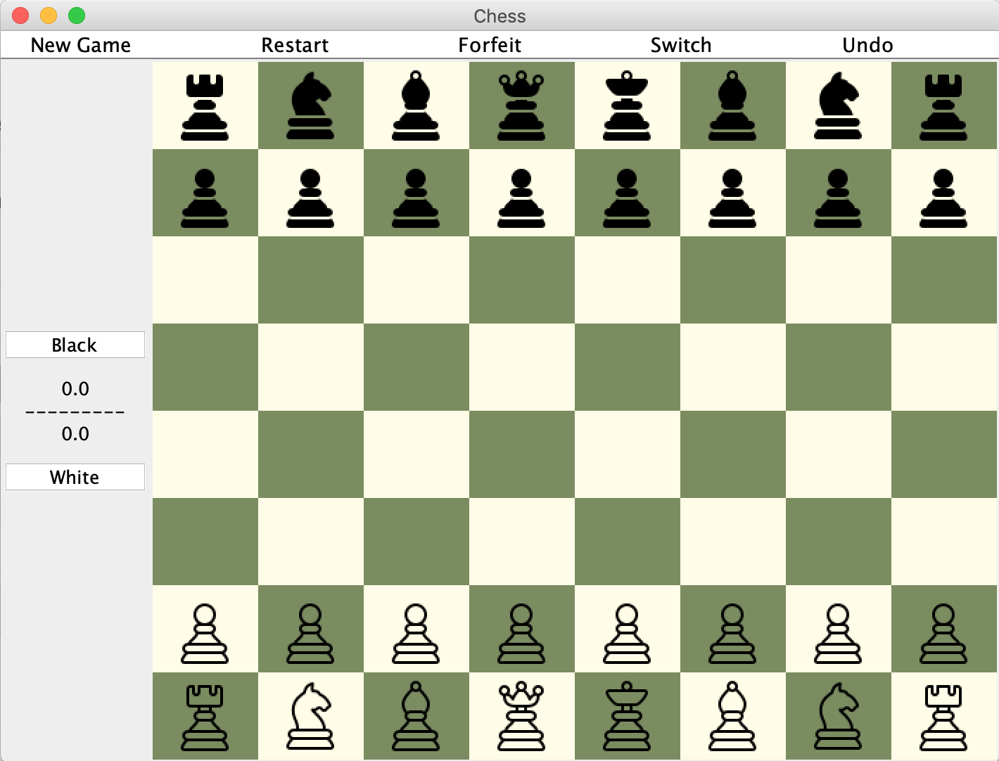

# Chess Application
This is a functional and interactive chess application with basic chess logic implemented, written in Java. It can be easily modified to be an android app. It also has two newly created and implemented chess piece. 

### Usage
Run the main function in gui.java. Detailed documentations about functions in the docs/.

### Preview

